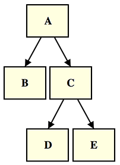

# treefun2

A tree diagram (SVG) generator. An updated version
of [treefun](https://github.com/jimblackler/treefun2), a tree builder that was
delivered as a static JS file. This new version can be installed with NPM, is
written in ES6 and has Typescript support.

https://www.npmjs.com/package/treefun2



## Use in a node project

```shell
npm install treefun2
```

### Browser example

This example generates and adds a diagram to the current document body.

```javascript
const treefun2 = require('treefun2');

const tree = [{
  label: 'World',
  children: [{
    label: 'Europe',
    children: [{
      label: 'France',
    }, {
      label: 'Germany'
    }]
  }]
}];

treefun2.treeToDiagram(document, document.body, tree, {}, '');
```

### Browser example with options and custom CSS

```javascript
const treefun2 = require('treefun2');

const tree = [{
  label: 'World',
  children: [{
    label: 'Europe',
    children: [{
      label: 'France',
    }, {
      label: 'Germany'
    }]
  }]
}];

const options = {
  flipXY: false,
  width: 320,
  height: 450,
  labelLineSpacing: 15,
  labelPadding: 2,
  arrowHeadWidth: 5,
  arrowHeadHeight: 5,
  arrowsUp: false,
  minimumSiblingGap: 0.1,
  idealSiblingGap: 0.1,
  minimumCousinGap: 0.2,
  idealCousinGap: 1.2,
  levelsGap: 1.2,
  cornerRounding: 4,
  minimumDepth: 0,
  minimumBreadth: 0
};

const css = `
  text {
    text-anchor: middle;
    font-size: x-small;
  }
  
  rect {
    fill: ghostwhite;
    stroke: black;
    stroke-width: 0.3px;
  }
  
  line {
    stroke: black;
    opacity: 0.5;
    stroke-width: 0.3px;
  }
`;

treefun2.treeToDiagram(document, document.body, tree, options, css);
```

### Server example

Diagrams can be generated in server-side code with the use
of [JSDOM](https://github.com/jsdom/jsdom). The below example creates a diagram
and writes it to a file `diagram.svg`.

```shell
npm install jsdom
```

```javascript
const fs = require('fs');
const jsdom = require('jsdom');
const treefun2 = require('treefun2');

const document = new jsdom.JSDOM().window.document;

const tree = [{
  label: 'World',
  children: [{
    label: 'Europe',
    children: [{
      label: 'France',
    }, {
      label: 'Germany'
    }]
  }]
}];

treefun2.treeToDiagram(document, document.body, tree, {}, '');
fs.writeFileSync('diagram.svg', document.body.innerHTML);
```
